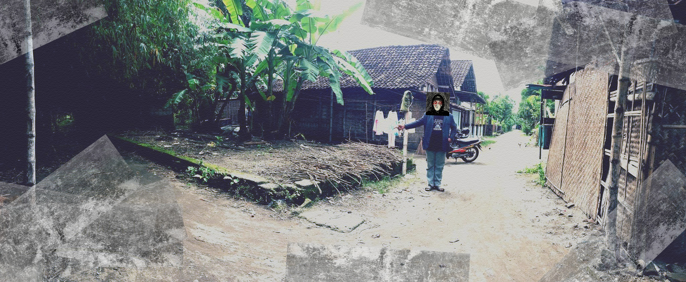
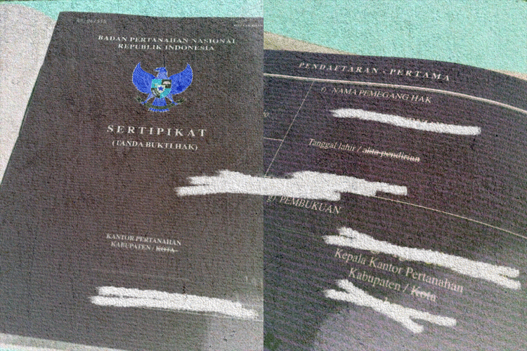
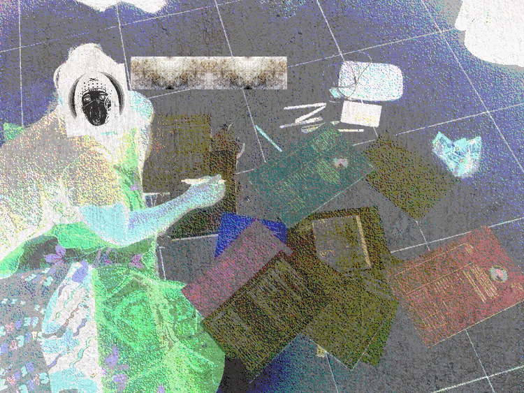
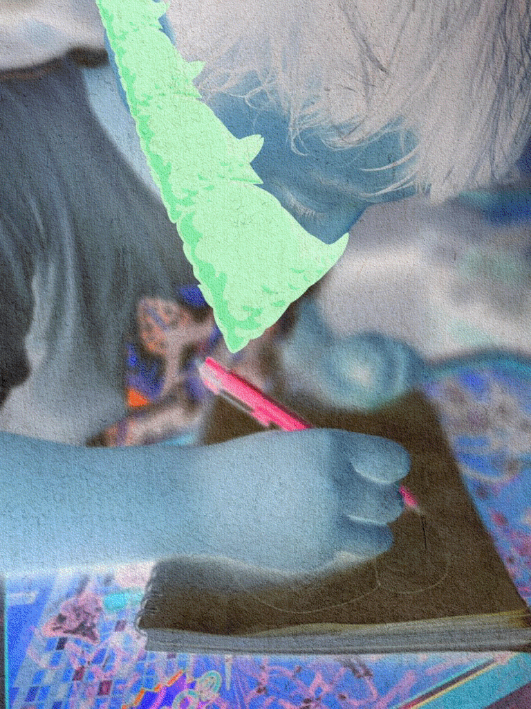

# 😁 How is the journey?


**Note**: When [**The KING's Office**](how-is-the-journey.md#id-5th-stage-grand-opening-of-the-kings-office-postponed), [**The Sanctuary of The KING's World**](how-is-the-journey.md#id-7th-stage-the-sanctuary-of-the-kings-world-postponed), and [**The KING's Story**](how-is-the-journey.md#id-9th-stage-starting-to-develop-and-setting-the-kings-story-june-2022) exist, there will be only **$HAIL**, **$OiOi**, and **$NOTA** **Fungible Tokens** as [**The Currencies**](../04-the-12th-stage.../the-currencies.md) that are valid for all activities.


## ~~1st Stage: The first foundation stone - May 2021~~


**Note**: [**1st stage**](how-is-the-journey.md#id-1st-stage-the-first-foundation-stone-may-2021) is done! **100%** is completed!


Good news! The land where [**The KING's Office**](how-is-the-journey.md#id-5th-stage-grand-opening-of-the-kings-office-postponed) will be built has been purchased and construction started with the laying of the first foundation stone by [**MyReceipt's Son**](../#preface).

> Base on [**The KING's NFTs**](https://app.gitbook.com/o/NPgwIhduqQPcS27tyJvV/s/ArIyZgyvhaWlCaXuVRLe/) project journey, the [**1st stage**](how-is-the-journey.md#id-1st-stage-the-first-foundation-stone-may-2021) is deploy [**the first foundation stone**](how-is-the-journey.md#id-1st-stage-the-first-foundation-stone-may-2021) for [**The KING's Office**](how-is-the-journey.md#id-5th-stage-grand-opening-of-the-kings-office-postponed) building.
>
> Good news, after purchasing a piece of abandoned and forgotten land where [**The KING's Office**](how-is-the-journey.md#id-5th-stage-grand-opening-of-the-kings-office-postponed) will be built, on May 2021 the construction started with the laying of [**the first foundation stone**](how-is-the-journey.md#id-1st-stage-the-first-foundation-stone-may-2021) by [**MyReceipt's Son**](../#preface).
>
> — Source: **GitFuckingHub**

Below is a photo documentation of the land where [**The KING's Office**](how-is-the-journey.md#id-5th-stage-grand-opening-of-the-kings-office-postponed) will be built.

<figure><figcaption>
The land where The KING's Office will be built.
</figcaption></figure>

***

## ~~2nd Stage: The birth and growth - October 2021~~


**Note**: [**2nd stage**](how-is-the-journey.md#id-2nd-stage-the-birth-and-growth-october-2021) is done! **100%** is completed!


Some of the documentation material since the birth of [**MyReceipt's Son**](../#preface) was minted in [**The 1st Batch**](../02-the-creations.../waivfves-1/46.-the-1st-batch-nft.md) of [**The KING's NFT**](https://app.gitbook.com/o/NPgwIhduqQPcS27tyJvV/s/ArIyZgyvhaWlCaXuVRLe/) collections (**B1**). The sale already began in September 2021.

> All items contain memorabilia about [**MyReceipt's Son**](../#preface). All of them are silent witnesses of growth and development, making it the rarest **NFT** by [**MyReceipt**](https://myreceipt.endhonesa.com/). Some items are minted and listed on the OpenSea marketplace, but largely unreleased and still remain unpublished.
>
> — Source: [**The 1st Batch collection**](https://opensea.io/collection/thekingscreations)

<figure><figcaption>
ALLHAILNFT.B2C1 #GEN
</figcaption></figure>

***

## ~~3rd Stage: The kindergarten (canceled)~~


**Note**: [**3rd stage**](how-is-the-journey.md#id-3rd-stage-the-kindergarten-canceled) is canceled! **100%** is not and will never be completed!


Starting in October 2021, any creations of [**MyReceipt's Son**](../#preface), in first-grade kindergarten school, will be collected and used as assets of **NFTs** that will be minted in [**The KING's NFTs**](https://app.gitbook.com/o/NPgwIhduqQPcS27tyJvV/s/ArIyZgyvhaWlCaXuVRLe/) spin-off collections (**AHA**) on OBJKT.com

All creations in this collection are physical works, and some of the processes of the creation have been documented in the video that is available on **Web 2.0**.

> But the reality that night breaks [**MyReceipt's mind**](how-is-the-journey.md#id-7th-stage-the-sanctuary-of-the-kings-world-postponed) making **Him** give up on **His** real life. In the morning, **He** was still online while **His** mind was bleeding rapidly and dying.
>
> That is how [**the 3rd stage**](how-is-the-journey.md#id-3rd-stage-the-kindergarten-canceled) was canceled. All creations that have already been collected, mostly physical works of [**MyReceipt's Son**](../#preface...) in first-grade kindergarten, have never been released as **NFT** assets in a spin-off collection of [**The KING's NFTs**](https://app.gitbook.com/o/NPgwIhduqQPcS27tyJvV/s/ArIyZgyvhaWlCaXuVRLe/).
>
> Since some of the processes of the creation have been documented in the video, now it is already switched to become privately available on **Web 2.0.**, hopefully, in the future, all of those creations can be released even if not as **NFT** assets.
>
> — Source: **GitFuckingHub**

***

## ~~4th Stage: The Anthropophobia Viruses widespread - November 2021~~


**Note**: [**4th stage**](how-is-the-journey.md#id-4th-stage-the-anthropophobia-viruses-widespread-november-2021) is done! **100%** is completed!


In this [**4th stage**](how-is-the-journey.md#id-4th-stage-the-anthropophobia-viruses-widespread-november-2021), the 1st collection from **The 2nd Batch** ([**B2/C1**](../02-the-creations.../waivfves-1/44.-anthropophobia.md)), which is the 1st programmatically generated **NFT** collection, is already widespread since November 2021.

> All abstract scribble layers are made by 5 years old [**MyReceipt's Son**](../#preface).
>
> — Source: [**Anthropophobia Viruses collection**](https://opensea.io/collection/anthropophobia-viruses)

Twelve thousand (12k) **Abstract Scribbles** of the [**Anthropophobia Viruses**](../02-the-creations.../waivfves-1/44.-anthropophobia.md), each one verified unique, all 100% minted out.

<figure><figcaption>
The Anthropophobia Viruses
</figcaption></figure>

***

## ~~5th Stage: Grand opening of The KING's Office June 2026~~


**Note**: The [**5th stage**](how-is-the-journey.md#id-5th-stage-grand-opening-of-the-kings-office-postponed) is done! **100%** is completed.


The grand opening of [**The KING's Office**](how-is-the-journey.md#id-5th-stage-grand-opening-of-the-kings-office-postponed)**,** scheduled for after all items in B2/C1 are minted out, has been postponed since June 2022. In June 2026, it is done. 100% is completed.

> The [**5th stage**](how-is-the-journey.md#id-5th-stage-grand-opening-of-the-kings-office-postponed) has been postponed. The grand opening of [**The KING's Office**](how-is-the-journey.md#id-5th-stage-grand-opening-of-the-kings-office-postponed), which was supposed to take place in early 2022, had to be postponed until an undetermined time.
>
> A phenomenon of [**The Melting Land**](../02-the-creations.../waivfves-2/15.-the-melting-land.md) is happening, forcing everyone that trapped to survive. Besides that, all items in [**B2/C1**](../02-the-creations.../waivfves-1/44.-anthropophobia.md) are just already minted out, but not really sold out.
>
> In June 2026, it is done. 100% completed.
>
> — Source: **GitFuckingHub**

<figure><figcaption>
The KING's Office Blueprint
</figcaption></figure>

***

## ~~6th Stage: B2/C2 collection launched - April 2022~~


**Note**: [**6th stage**](how-is-the-journey.md#id-6th-stage-b2-c2-collection-launched-april-2022) is done! **100%** is completed!


In this [**6th stage**](how-is-the-journey.md#id-6th-stage-b2-c2-collection-launched-april-2022), the [**B2/C2**](../02-the-creations.../waivfves-1/32.-prof.-nota-genesis-0-1.md) collection was already launched in April 2022 and 100% minted out in December 2022.

> [**B2/C2**](../02-the-creations.../waivfves-1/32.-prof.-nota-genesis-0-1.md) is the 2nd collection from **The 2nd Batch** which is the genesis work that marks the occurrence of [**Prof. NOTA**](https://nota.endhonesa.com/) on the blockchain. This happened simultaneously with the emergence of [**Prof. NOTA**](https://nota.endhonesa.com/) in the **IDNFT Academy**.
>
> Using the concept from the "[**Your Cursor is BOMB!**](../02-the-creations.../waivfves-1/35.-y.c.i.bomb/)", a collection on OBJKT.com created by [**MyReceipt**](https://myreceipt.endhonesa.com/), apart from being a mark, this work is also a tribute to **IDNFT Academy** participants who have **Played**, **Learned**, and **Worked** together with [**Prof. NOTA**](https://nota.endhonesa.com/).
>
> — Source: [**Prof. NOTA Genesis NFTs collection**](https://opensea.io/collection/prof-nota)

<figure><figcaption>
Prof. NOTA Genesis
</figcaption></figure>

***

## ~~7th Stage: The sanctuary of The KING's World September 2026~~


**Note**: The [**7th stage**](how-is-the-journey.md#id-7th-stage-the-sanctuary-of-the-kings-world-postponed) is done! **100%** is completed.


[**The sanctuary of The KING's World**](how-is-the-journey.md#id-7th-stage-the-sanctuary-of-the-kings-world-postponed) deployment has been postponed by [**Prof. NOTA**](https://nota.endhonesa.com/). In September 2026, in the momentum of the glitch between the **Before Melting (B.M.)** and the **Melting Date**, the deployment 100% completed.

> Since the grand opening of [**The KING's Office**](how-is-the-journey.md#id-5th-stage-grand-opening-of-the-kings-office-postponed) postponed, so the operation of [**The sanctuary of The KING's World**](how-is-the-journey.md#id-7th-stage-the-sanctuary-of-the-kings-world-postponed) also postponed and can't be happen until an undetermined time.
>
> In September 2026, it is done. 100% completed.
>
> — Source: **GitFuckingHub**

<figure><figcaption>
The Freehold Title of the land where The KING's Office will be built.
</figcaption></figure>

***

## ~~8th Stage: B2/C3 collection started - May 2022~~


**Note**: The [**8th stage**](how-is-the-journey.md#id-8th-stage-b2-c3-collection-started-may-2022) is done! **100%** is completed!


In this [**8th stage**](how-is-the-journey.md#id-8th-stage-b2-c3-collection-started-may-2022), the [**B2/C3**](../02-the-creations.../waivfves-1/31.-0101-of-prof.-nota.md) collection launched in May 2022. [**B2/C3**](../02-the-creations.../waivfves-1/31.-0101-of-prof.-nota.md) is the 3rd collection from **The 2nd Batch**, which is [**0101 of Prof. NOTA**](../02-the-creations.../waivfves-1/31.-0101-of-prof.-nota.md) and contains the assignment of an initial value for all of [**Prof. NOTA**](https://nota.endhonesa.com/)'s creations.

> The first item is **0101 init**, a collaboration artwork between [**Prof. NOTA**](https://nota.endhonesa.com/) and **Pensiunan Setan**, the assignment of an initial value for all [**Prof. NOTA**](https://nota.endhonesa.com/)'s creations.
>
> — Source #1: [**0101 init in 0101 of Prof. NOTA collection**](https://objkt.com/asset/KT18taVYgQ35rcuCca5QN7uq5EsFxKJyJvRT/0)
>
> — Source #2: [**0101 of Prof. NOTA collection**](https://objkt.com/collection/KT18taVYgQ35rcuCca5QN7uq5EsFxKJyJvRT)

<figure><figcaption>
0101 init…
</figcaption></figure>

All announcements about this collection will be posted on [**Prof. NOTA's Discord**](https://discord.gg/5KrsT6MbFm).

***

## ~~9th Stage: Starting to develop and setting The KING's Story - June 2022~~


**Note**: The [**9th stage**](how-is-the-journey.md#id-9th-stage-starting-to-develop-and-setting-the-kings-story-june-2022) is done! **100%** is completed!


This [**9th stage**](how-is-the-journey.md#id-9th-stage-starting-to-develop-and-setting-the-kings-story-june-2022) is the time to develop and set the[ **KING's Story**](how-is-the-journey.md#id-9th-stage-starting-to-develop-and-setting-the-kings-story-june-2022). Since June 2022, [**The KING's Story**](how-is-the-journey.md#id-9th-stage-starting-to-develop-and-setting-the-kings-story-june-2022) began to be written and developed little by little. The whole story was written and developed by [**Prof. NOTA**](https://nota.endhonesa.com/).

> All the creations, that is the various **NFT** that you have will be used to build [**The KING's Story**](how-is-the-journey.md#id-9th-stage-starting-to-develop-and-setting-the-kings-story-june-2022)
>
> — Source: **GitFuckingHub**

<figure><figcaption>
Paperwork for The KING's Story
</figcaption></figure>


[the-story...](../03-the-story.../the-story.../)


***

## ~~10th Stage: B2/C4 collection launched - January 2023~~


**Note**: The [**10th stage**](how-is-the-journey.md#id-10th-stage-b2-c4-collection-launched-january-2023) is done! **100%** is completed!


In this ​​[**10th stage**](how-is-the-journey.md#id-10th-stage-b2-c4-collection-launched-january-2023), the **B2/C4** collection started to be launched in January 202&#x33;**,** and the first collection of [**/ˈdeTH ˌwiSH/**](../02-the-creations.../waivfves-1/21.-deth-wish.md) sold out two weeks after launch on the Foundation marketplace (RIP).

> The 4th collection from **The 2nd Batch** (**B2/C4**) will become [**/ˈdeTH ˌwiSH/**](../02-the-creations.../waivfves-1/21.-deth-wish.md) collection series with multiple collections, also maybe in multiple blockchain. The first collection, that is titled by [**Prof. NOTA**](https://nota.endhonesa.com/) with the same name, used to preserve [**MyReceipt**](https://myreceipt.endhonesa.com/) hope for **His** dream also to perform an emergency experimental idea to save [**MyReceipt**](https://myreceipt.endhonesa.com/) from **His** [**/ˈdeTH ˌwiSH/**](../02-the-creations.../waivfves-1/21.-deth-wish.md).
>
> — Source: [**The first collection of /ˈdeTH ˌwiSH/ in the Ethereum blockchain**](https://opensea.io/collection/deathwish-eth)

<figure><figcaption>
/ˈdeTH ˌwiSH/
</figcaption></figure>

***

## ~~11th Stage: Collection of The KING's Book started - March 2023~~


**Note**: The [**11th stage**](how-is-the-journey.md#id-11th-stage-book-of-the-kings-story-started-march-2023) is done! **100%** is completed!


In this [**11th stage**](how-is-the-journey.md#id-11th-stage-book-of-the-kings-story-started-march-2023), a collection of [**The KING's Book**](how-is-the-journey.md#id-11th-stage-collection-of-the-kings-book-started-march-2023), one of which is [**The KING's Story**](../03-the-story.../the-story.../), will be released, and to start the realization by [**Prof. NOTA**](https://nota.endhonesa.com/), a section was created on this GitBook, called [**#03 - THE STORY**](https://app.gitbook.com/s/ArIyZgyvhaWlCaXuVRLe/03-the-story...).

> It means the collection of [**The KING's Book**](how-is-the-journey.md#id-11th-stage-collection-of-the-kings-book-started-march-2023) realization starts with the goal of the book set of [**The KING's Book**](how-is-the-journey.md#id-11th-stage-collection-of-the-kings-book-started-march-2023) can be released physically or digitally on [**Prof. NOTA's Discord**](https://discord.gg/5KrsT6MbFm) and somewhere else that is more proper.
>
> — Source: [**Prof. NOTA's Discord**](https://discord.gg/5KrsT6MbFm)

<figure><figcaption>
Book of The KING's Story init...
</figcaption></figure>


[the-story...](../03-the-story.../the-story.../)


***

## 12th Stage: ...


**Note:** After this, starting from the [**12th stage**](how-is-the-journey.md#id-12th-stage-keep-playing-learning-and-working-47-on-web3-for-the-king-and-so-on)**,** all will be evaluated by the community. Since the community will decide what to do with it next. More details in [**#04 - The 12th Stage...**](https://app.gitbook.com/s/ArIyZgyvhaWlCaXuVRLe/04-the-12th-stage...) section.


[**The 12th stage**](how-is-the-journey.md#id-12th-stage-keep-playing-learning-and-working-47-on-web3-for-the-king-and-so-on) will be updated in the [**#04 - The 12th Stage**](https://app.gitbook.com/s/ArIyZgyvhaWlCaXuVRLe/04-the-12th-stage...) section. Okay, **OiOi**!!!!

Keep Playing, Learning, and Working 47% on Web3 with the AI in the Decentralized Blockchain Network for The KING, and so on...

***
