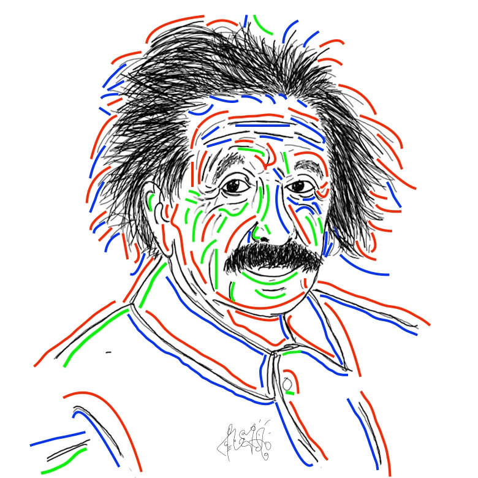
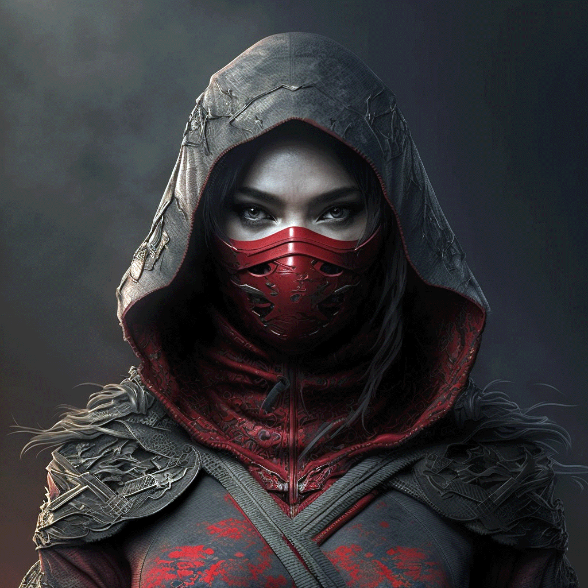

# 🧐 What does it look like?


**Note**: Most details and previews are available in [**#02 - The Creations**](https://app.gitbook.com/s/ArIyZgyvhaWlCaXuVRLe/02-the-creations...) section.


## Anthropophobia Viruses

Below is the [**Anthropophobia Viruses**](../02-the-creations.../waivfves-1/44.-anthropophobia.md), a generative artwork with **abstract scribbles** by [**MyReceipt's 5-year-old Son**](../#preface).

> All abstract scribble layers are made by [**MyReceipt's Son**](../#preface).
>
> — Source: [**Anthropophobia Viruses collection**](https://opensea.io/collection/anthropophobia-viruses)

<figure><figcaption><p>The Anthropophobia Viruses</p></figcaption></figure>

***

## Mark Zuckerberg's Move To Twitter

This is just a sneak peek from the [**Screen Croots**](../02-the-creations.../waivfves-1/47.-screen-croots.md) collection.

Below is **Screen Shot 2021-10-05 at 00.10.05** as a receipt when Facebook, Instagram, and WhatsApp users suddenly moved to Twitter on Oct. 05, 2021, at 00.10.05 GMT +7, and the trends are flooded by that topic; of course, Mark Zuckerberg did not miss it.

> This a very very rare screenshot since it only happens when Mark Zuckerberg goes trending on Twitter but not on Facebook, Instagram, and WhatsApp.
>
> Very unique since this screenshot was created on Oct. 05, 2021, at 00.10.05 GMT +7, and can't be repeated, except you have a time machine to go back to the time before.
>
> — Source: [**Screen Croots collection**](https://opensea.io/collection/screen-croots)

<figure><figcaption><p>Mark Zuckerberg Move To Twitter</p></figcaption></figure>

***

## Scribble on Einstein's Face

Just a sneak peek from the [**Scribbled Faces**](../02-the-creations.../waivfves-1/45.-scribbled-faces.md) collection.

Below is a **Scribble on Einstein's Face**. Don't worry, it happens when [**MyReceipt**](https://myreceipt.endhonesa.com/) learns to scribble on Einstein's face, not on your face.

> You can buy and collect it all and you can make revenge scribbles on [**MyReceipt**](https://myreceipt.endhonesa.com/) face, anytime, anywhere.
>
> — Source: [**Scribbled Faces collection**](https://opensea.io/collection/scribbled-faces)

<figure><figcaption><p>Scribble on Einstein's Face</p></figcaption></figure>

***

## The Breads Factory: Logo 10k

Just a sneak peek from [**The Breads Factory: Logo 10k**](../02-the-creations.../waivfves-1/43.-logo-pabrik-roti/) collection. Below is a preview of [**The Breads Factory: Logo 10k**](../02-the-creations.../waivfves-1/43.-logo-pabrik-roti/).

> More [**The Breads Factory: Logo 10k**](../02-the-creations.../waivfves-1/43.-logo-pabrik-roti/) is available on the OpenSea marketplace.
>
> — Source: [**The Breads Factory: Logo 10k collection**](https://opensea.io/collection/logo-pabrik-roti)

<figure><figcaption><p>The Breads Factory: Logo 10k</p></figcaption></figure>

***

## NOTHING (the genesis)

Just a sneak peek from the [**NOTHING (the genesis)** **NFT**](../02-the-creations.../waivfves-1/26.-nothing-the-genesis/). Below is a preview:

```
47   74  474747  747474  47  47  74  47   74    47474  
474  74  47  47    74    47  47  74  474  74   74          
47 7 74  47  47    74    474747  74  47 7 74  47   474  
47  474  47  47    74    47  47  74  47  474  47     47
47   74  474747    74    47  47  74  47   74   7474747

Disclaimer:
This typed text really does nothing at all.
...
...
...
...
Why NOTHING, then?
Well, how many times have you paid NOTHING and got something back?
Now I offer you a unique opportunity, You pay something and get NOTHING back!
...
...
...
...
...
...
...
This typed text does absolutely NOTHING.
By purchasing this typed text you will help to prove that NOTHING is indeed worth something.
With this NOTHING-typed text, you prove that NOTHING is worth even more!
...
...
...
...
Warm regards,
Prof. NOTA

47   74  474747  747474  47  47  74  47   74    47474  
474  74  47  47    74    47  47  74  474  74   74          
47 7 74  47  47    74    474747  74  47 7 74  47   474  
47  474  47  47    74    47  47  74  47  474  47     47
47   74  474747    74    47  47  74  47   74   7474747
```

> More ASCII arts are available on Typed.Art and OBJKT.com.
>
> — Source: [**NOTHING (the genesis) on OBJKT.com**](https://objkt.com/tokens/typed/6088)

***

## Shenonymous Scammer

The [**! IMPROMPTU !**](../02-the-creations.../waivfves-1/30.-impromptu.md) collection now already has 21 items, and the 11th item is the **Shenonymous Scammer**.

<figure><figcaption><p>Shenonymous Scammer</p></figcaption></figure>

> After the last item sold out, you only can get it from secondary sales.
>
> So, go get it now for the last chance!
>
> — Source: [**! IMPROMPTU ! collection**](https://objkt.com/collection/KT1X3hLhhmLXZh89seeakhCy4bEsnhDhupPc)

***
