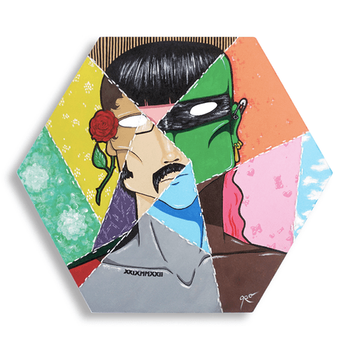
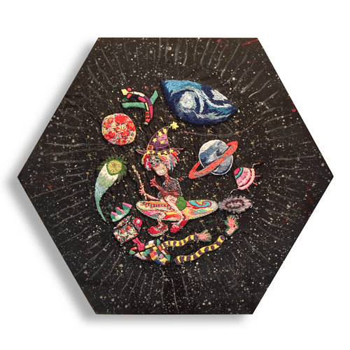

# ✅ 24. Conserve Roty Broi ⛵


**Note**: [**Conserve Roty Broi NFTs**](24.-conserve-roty-broi.md) are **MINTED OUT**!!!!


Spin-Off: This collection contains **physical artworks** by various traditional artists in **BALI island** to conserve some of [**The ROTY BROI NFTs' artwork**](41.-the-roty-broi.md) assets.

***

```
Launcher: Prof. NOTA 
```

```
0x Creator: 29bF68E3969E0b6686ea55B7C48241ba3f6B9bA0
```

```
Developer: Prof. NOTA
```

```
Artist: Various Traditional Artists X Suwar Kainde X Prof. NOTA
```

```
Royalty: 7.47% on OpenSea.IO, 100% distributed to Prof. NOTA.
```

***

> All **physical artworks** will belong to the **NFT** holder in this collection. They can claim it in [**Prof. NOTA's Discord**](https://discord.gg/5KrsT6MbFm).
>
> — Source #1: [**CONSERVATION Landing Page Web**](https://conservation.endhonesa.com/)
>
> — Source #2: [**CONSERVATION on OpenSea market**](https://opensea.io/collection/conserve-roty-broi)

***

> BONUS: [**ROTY BROI Art**](../../04-the-12th-stage.../breads-factory/breads-chapter-10k.md#id-09981.-roty-broi-art-sold-out) on GAMMA.io (excluded).
>
> This is a derivative artwork collection on the **Stacks** blockchain from [**The ROTY BROI NFTs**](41.-the-roty-broi.md) project on the **Polygon** blockchain. This is also an experimental collection by [**PabrikRoti.IDN**](../../04-the-12th-stage.../breads-factory/) to prove whether is [**ROTY BROI**](41.-the-roty-broi.md) art style accepted or not by the collectors in this crypto art world, especially in the **Stacks** blockchain ecosystem.
>
> — Source: [**ROTY BROI Art on GAMMA.io**](https://stacks.gamma.io/collections/roty-broi-art)

***

#### The Objectives...

1. As a medium for pouring stories from [**MyReceipt's thoughts**](https://myreceipt.endhonesa.com/) about the phenomenon in the reality of his life that should be a gift.
2. Emphasize and improve the occurrence of [**Prof. NOTA**](https://nota.endhonesa.com/) on the blockchain by collaborating with some artists in the **Universe of Reality**.
3. Gathering an audience in the **Universe of Reality** to make collaborations and partnerships in introducing and developing [**The Melting Land**](../waivfves-2/15.-the-melting-land.md) story.
4. Generating revenue for living expenses for [**MyReceipt**](https://myreceipt.endhonesa.com/) so [**Prof. NOTA**](https://nota.endhonesa.com/) can develop and set the story of [**The Melting Land**](../waivfves-2/15.-the-melting-land.md).
5. For [**Prof. NOTA**](https://nota.endhonesa.com/) expression, and fun with **Them** on **Web3**.

***

#### Holder Benefit...

* All [**Conserve Roty Broi NFTs**](24.-conserve-roty-broi.md) holders, at least 1 supply, are able to claim the physical artwork asset by joining [**Prof. NOTA's Discord**](https://discord.gg/5KrsT6MbFm) to drop their shipping address and pay the shipping cost.
* All [**Conserve Roty Broi NFTs**](24.-conserve-roty-broi.md) holders, at least 1 supply, are able to claim giveaways, that is, [**The ROTY BROI NFTs**](41.-the-roty-broi.md). Please go to [**Prof. NOTA's Discord** ](https://discord.gg/5KrsT6MbFm)to claim, and [**Prof. NOTA**](https://nota.endhonesa.com/) will transfer the **NFTs** to your wallet.
* All [**Conserve Roty Broi NFTs**](24.-conserve-roty-broi.md) holders, at least 1 supply, are whitelisted for the [**ROTY BASE dETH**](16.-roty-base-deth.md) collection that will be released on the **BASE** blockchain. Please go to [**Prof. NOTA's Discord**](https://discord.gg/5KrsT6MbFm) for more information, and [**Prof. NOTA**](https://nota.endhonesa.com/) can include your address on the allowlist for early access.
* All [**Conserve Roty Broi NFTs**](24.-conserve-roty-broi.md) holders, at least 1 supply, are whitelisted for the [**2nd /ˈdeTH ˌwiSH/**](../waivfves-2/13.-2nd-deth-wish.md) collection that will be released on the blockchain.

***

<div><figure><figcaption><p>Volare</p></figcaption></figure> <figure><figcaption><p>Astral Traveling Investigation</p></figcaption></figure></div>

<figure><figcaption><p>Seeing Reality</p></figcaption></figure>

***
