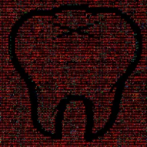

# ☑️ 25. Guts of Prof. NOTA!


**Note**: [**Guts of Prof. NOTA**](25.-guts-of-prof.-nota.md) is **100%** minted completely!


Spin-Off: If you have **GUTS**, let's make an **INVASION**!

***

```
Launcher: Dhani Chaniago
```

```
tz Creator: 1feFH8UBVKEuefC1nFt3SX3brbn67vxRdL
```

```
Developer: UseAxe X Prof. NOTA
```

```
Artist: Prof. NOTA
```

```
Royalty: 10% on OBJKT.com, 4% distributed to Dhani Chaniago, and 6% to Prof. NOTA.
```

***

> [**Guts of Prof. NOTA**](25.-guts-of-prof.-nota.md) is interactive **NFT** as a receipt of collaboration between **Guts Invasion** and [**Prof. NOTA**](https://nota.endhonesa.com/).
>
> — Source: [**Guts of Prof. NOTA on market**](https://objkt.com/asset/KT1MgJePK3uAfBM7byKnbFop8vJQW474ej64/24)&#x20;

***

#### The Objectives...

1. Emphasize and improve the occurrence of [**Prof. NOTA**](https://nota.endhonesa.com/) on the blockchain by collaborating with some **Web3** artists.
2. Provide a way out for [**MyReceipt**](https://myreceipt.endhonesa.com/) to retire from coding for something functional rather than something expressive.
3. For [**Prof. NOTA**](https://nota.endhonesa.com/) expression, and fun with **Them** on **Web3**.

***

#### Holder Benefit...

* All [**Guts of Prof. NOTA**](25.-guts-of-prof.-nota.md) holders, at least 1 edition, can claim giveaways, that is, the [**Anthropophobia Viruses NFTs**](44.-anthropophobia.md). Please go to [**Prof. NOTA's Discord** ](https://discord.gg/5KrsT6MbFm)to claim, and [**Prof. NOTA**](https://nota.endhonesa.com/) will transfer the **NFTs** to your wallet.
* All [**Guts of Prof. NOTA**](25.-guts-of-prof.-nota.md) holders, at least 1 edition, are whitelisted for the [**ROTY BASE dETH** ](16.-roty-base-deth.md)collection that will be released on the **BASE** blockchain. Please go to [**Prof. NOTA's Discord**](https://discord.gg/5KrsT6MbFm) for more information, and [**Prof. NOTA**](https://nota.endhonesa.com/) can include your address on the allowlist for early access.

***

<figure><figcaption><p>Guts of Prof. NOTA!</p></figcaption></figure>

***
