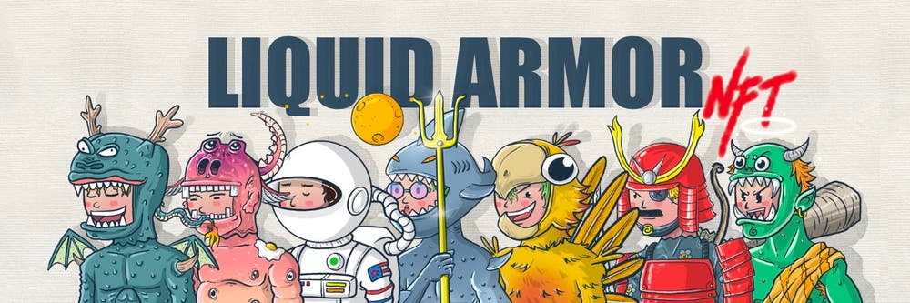

# ☑️ 28.1. Liquid Armor ⛵


**Note**: [**Liquid Armor NFTs**](28.1.-liquid-armor.md) are 100% **SOLD OUT**!


This collection is not [**Prof. NOTA**](https://nota.endhonesa.com/)'s creation. This is only the complement for [**The KING's Story**](../../../01-the-project.../how-is-the-journey.md#9th-stage-starting-to-develop-and-settings-the-kings-story-june-2022), on the **Polygon** blockchain.

> [**Liquid Armor NFTs**](28.1.-liquid-armor.md), a collection containing artworks by **Edwan Eka** that tell about someone who has the power to turn liquids into desired armor objects.
>
> — Source: [**Liquid Armor NFTs on market**](https://exchange.art/series/LIQUID%20ARMOR%20PFP/nfts)

***

#### Holder Benefit...

* All [**Liquid Armor NFTs**](28.1.-liquid-armor.md) holders, at least 1 supply, are able to claim giveaways, that is, the [**Anthropophobia Viruses NFTs**](../44.-anthropophobia.md). Please go to [**Prof. NOTA's Discord** ](https://discord.gg/5KrsT6MbFm)to claim, and [**Prof. NOTA**](https://nota.endhonesa.com/) will transfer the **NFTs** to your wallet.
* All [**Liquid Armor NFTs**](28.1.-liquid-armor.md) holders, at least 1 supply, are whitelisted for the [**ROTY BASE dETH**](../16.-roty-base-deth.md) collection that will be released on the **BASE** blockchain. Please go to [**Prof. NOTA's Discord**](https://discord.gg/5KrsT6MbFm) for more information, and [**Prof. NOTA**](https://nota.endhonesa.com/) can include your address on the allowlist for early access.

***

<figure><figcaption>
Liquid Armor NFTs
</figcaption></figure>

***
