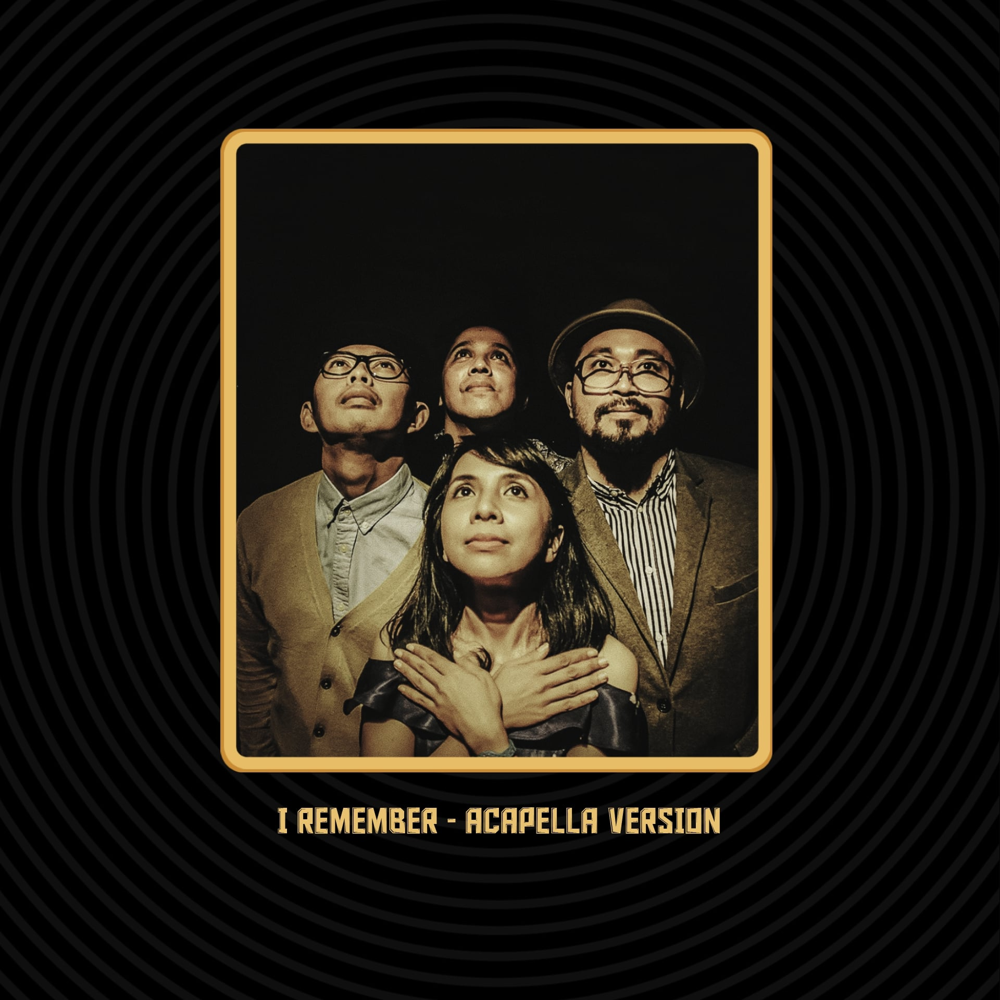

# ☑️ 29. MOCCA Music Player


**Note**: [**MOCCA Music Player NFTs**](29.-mocca-music-player.md) are **100%** minted completely!


Spin-Off: **MOCCA - I Remember** (acapella version) **Music Player** is a collaboration between **MOCCA** band and [**Prof. NOTA**](https://nota.endhonesa.com/). This **NFT** music player is an interactive **NFT**.

***

```
Launcher: MOCCA Official
```

```
tz Creator: 1feFH8UBVKEuefC1nFt3SX3brbn67vxRdL
```

```
Developer: Prof. NOTA
```

```
Artist: MOCCA X Prof. NOTA
```

```
Royalty: 14.9% on OBJKT.com, 7.5% distributed to MOCCA Official, and 7.4% to Prof. NOTA.
```

***

> SPECIAL AIRDROP FOR HOLDER OF **MOCCA MUSIC GOLD CARD**.
>
> — Source: [**MOCCA Music Player on market**](https://objkt.com/asset/KT1DNd6vMWMCgvnpKYiEX6JddUPpFuPXAkz9/0)

***

#### The Objectives...

1. Emphasize and improve the occurrence of [**Prof. NOTA**](https://nota.endhonesa.com/) on the blockchain by collaborating with some artists in the **Universe of Reality**.
2. Provide a way out for [**MyReceipt**](https://myreceipt.endhonesa.com/) to retire from coding for something functional rather than something expressive.
3. For [**Prof. NOTA**](https://nota.endhonesa.com/) expression, and fun with **Them** on **Web3**.

***

#### Holder Benefit...

* All [**MOCCA Music Player**](29.-mocca-music-player.md) holders, at least 1 edition, are able to claim giveaways, that is the [**Anthropophobia Viruses NFTs**](44.-anthropophobia.md). Please go to [**Prof. NOTA's Discord** ](https://discord.gg/5KrsT6MbFm)to claim, and [**Prof. NOTA**](https://nota.endhonesa.com/) will transfer the **NFTs** to your wallet.
* All [**MOCCA Music Player**](29.-mocca-music-player.md) holders, at least 1 edition, are whitelisted for the [**ROTY BASE dETH**](16.-roty-base-deth.md) collection that will be released on the **BASE** blockchain. Please go to [**Prof. NOTA's Discord**](https://discord.gg/5KrsT6MbFm) for more information, and [**Prof. NOTA**](https://nota.endhonesa.com/) can include your address on the allowlist for early access.

***

<figure><figcaption><p>MOCCA - I Remember (acapella version)</p></figcaption></figure>

***
