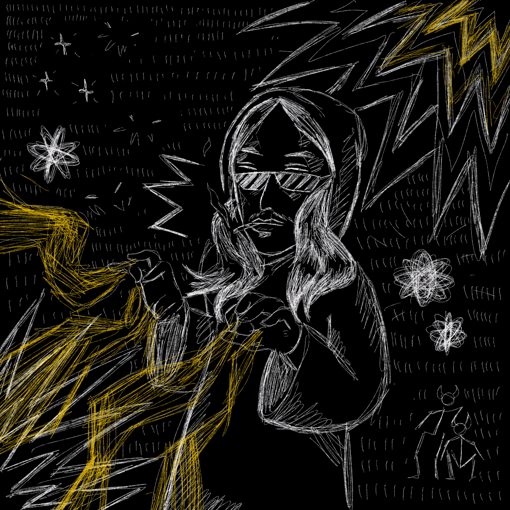

# ✅ 31. 0101 of Prof. NOTA


**Note**: [**0101 NFTs**](31.-0101-of-prof.-nota.md) are **SOLD & DISCONTINUED**!!!!


**B2C3**: [**0101 of Prof. NOTA**](31.-0101-of-prof.-nota.md) contains the assignment of an initial value for all of [**Prof. NOTA**](https://nota.endhonesa.com/)'s creations.

***

```
Launcher: Prof. NOTA
```

```
tz Creator: 1feFH8UBVKEuefC1nFt3SX3brbn67vxRdL
```

```
Developer: nulled
```

```
Artist: Retired Satan X Prof. NOTA
```

```
Royalty: 9.9% on OBJKT.com, 5.2% distributed to Retired Satan, and 4.7% to Prof. NOTA.
```

***

> The first item is **0101 init**, a collaboration artwork between [**Prof. NOTA**](https://nota.endhonesa.com/) and **Pensiunan Setan**, the assignment of an initial value for all [**Prof. NOTA**](https://nota.endhonesa.com/)'s creations.
>
> — Source #1: [**0101 of Prof. NOTA on OBJKT.com market**](https://objkt.com/collection/KT18taVYgQ35rcuCca5QN7uq5EsFxKJyJvRT)\
> — Source #2: [**Our Stories from 0101 Universe**](https://nota.endhonesa.com/)

***

#### The Objectives...

1. This is an initiative to bring the whole story of [**Prof. NOTA**](https://nota.endhonesa.com/), before and after the occurrence on the blockchain.
2. A collaboration with one of the **Web3** artists to bring "**Retired Satan"** and **"Mr. Satan**" to the **Tezos** blockchain, also to introduce and develop [**The Melting Land**](../waivfves-2/15.-the-melting-land.md) story.
3. [**Prof. NOTA**](https://nota.endhonesa.com/)'s campaign reminds everyone to be aware of personal security.
4. For [**Prof. NOTA**](https://nota.endhonesa.com/) expression, and fun with **Them** on **Web3**.
5. Provide a way out for [**MyReceipt**](https://myreceipt.endhonesa.com/) to **Rest in Proxy** and to be written in a book.

***

#### Holder Benefit...

* All [**0101 of Prof. NOTA**](31.-0101-of-prof.-nota.md) holders, at least 1 edition, can claim giveaways, that is, the [**Anthropophobia Viruses NFTs**](44.-anthropophobia.md). Please go to [**Prof. NOTA's Discord** ](https://discord.gg/5KrsT6MbFm)to claim, and [**Prof. NOTA**](https://nota.endhonesa.com/) will transfer the **NFTs** to your wallet.
* All [**0101 of Prof. NOTA**](31.-0101-of-prof.-nota.md) holders, at least 1 edition, are whitelisted for the [**ROTY BASE dETH**](16.-roty-base-deth.md) collection that will be released on the **BASE** blockchain. Please go to [**Prof. NOTA's Discord**](https://discord.gg/5KrsT6MbFm) for more information, and [**Prof. NOTA**](https://nota.endhonesa.com/) can include your address on the allowlist for early access.
* All [**0101 of Prof. NOTA**](31.-0101-of-prof.-nota.md) holders, at least 1 edition, are whitelisted for the [**2nd /ˈdeTH ˌwiSH/**](../waivfves-2/13.-2nd-deth-wish.md) collection that will be released on the blockchain.

***

<figure><figcaption><p>0101 init</p></figcaption></figure>

***
