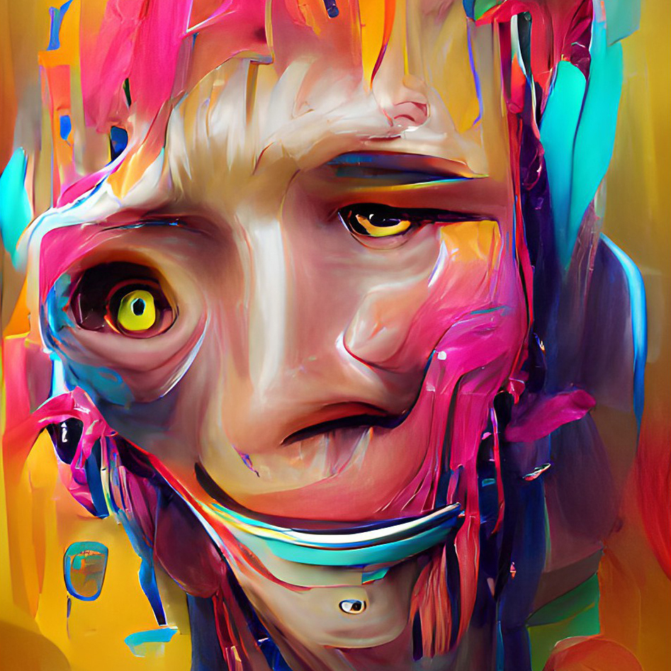

# ☑️ 38. DES.PER.ATE


**Note**: [**DES.PER.ATE NFTs**](38.-des.per.ate.md) are **100%** minted completely!


Spin-Off: This is a collection containing 60 OBJKTs showing the desperate human face.

Currently minted and listed by [**Prof. NOTA**](https://nota.endhonesa.com/) on OBJKT.com. You can collect all of them in your own wallet.

***

```
Launcher: Prof. NOTA
```

```
tz Creator: 1feFH8UBVKEuefC1nFt3SX3brbn67vxRdL
```

```
Developer: Prof. NOTA
```

```
Artist: Prof. NOTA
```

```
Royalty: 7.47% on OBJKT.com, 100% distributed to Prof. NOTA.
```

***

> [**DES.PER.ATE**](38.-des.per.ate.md) /ˈdesp(ə)rət/ adjective: feeling, showing, or involving a hopeless sense that a situation is so bad as to be impossible to deal with.
>
> — Source: [**DES.PER.ATE OBJKTs on market**](https://objkt.com/collection/KT1UW3tU6MsdjLeF6BYuBuNC3C5cMUSK64dr)

***

#### The Objectives...

1. Doing an exploration to find out the advantages and disadvantages of the **NFTs** market and community on the **Tezos** blockchain, mainly on the OBJKT.com marketplace.
2. As a medium for pouring stories from [**Prof. NOTA**](https://nota.endhonesa.com/)'s thoughts about the phenomenon in the reality of [**MyReceipt's life**](https://myreceipt.endhonesa.com/) that should be a gift.
3. Play around with **A.I. artwork** while learning how to introduce it to **Tezos NFT** collectors.
4. One of the last attempts, with the hope of generating revenue for the additional costs of building [**The KING's Office**](../../01-the-project.../how-is-the-journey.md#1st-stage-the-first-foundation-stone-may-2021).

***

#### Holder Benefit...

* All [**DES.PER.ATE OBJKTs**](38.-des.per.ate.md) holders, at least 1 supply, are able to claim giveaways, that is, the [**Anthropophobia Viruses NFTs**](44.-anthropophobia.md). Please go to [**Prof. NOTA's Discord** ](https://discord.gg/5KrsT6MbFm)to claim, and [**Prof. NOTA**](https://nota.endhonesa.com/) will transfer the **NFTs** to your wallet.
* All [**DES.PER.ATE OBJKTs**](38.-des.per.ate.md) holders, at least 1 supply, are whitelisted for the [**ROTY BASE dETH**](16.-roty-base-deth.md) collection that will be released on the **BASE** blockchain. Please go to [**Prof. NOTA's Discord**](https://discord.gg/5KrsT6MbFm) for more information, and [**Prof. NOTA**](https://nota.endhonesa.com/) can include your address in the allowlist for early access.

***

<figure><figcaption><p>Human face when desperate.</p></figcaption></figure>

***
