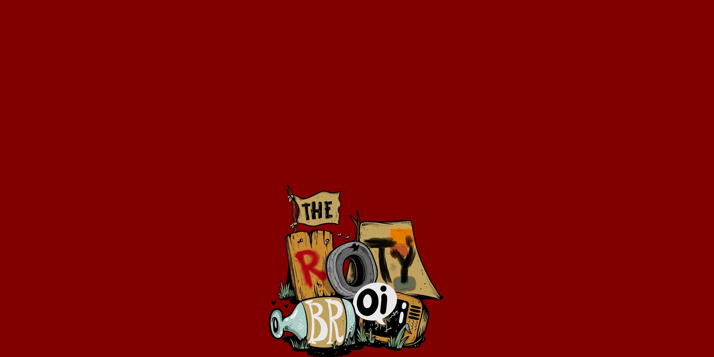

# ✅ 41. The ROTY BROI ⛵


**Note**: [**The ROTY BROI NFTs**](41.-the-roty-broi.md) are **100%** minted completely!


Spin-Off: [**The ROTY BROI**](41.-the-roty-broi.md) is a collection of 1047 unique generative and handpicked **NFTs** that live on the **Polygon** blockchain. Each **NFT** is made from over 100+ traits. Each trait is meticulously hand-drawn and crafted by **The BROY**, then mixed and generated by [**LOGO PABRIK ROTI**](43.-logo-pabrik-roti/) of [**PabrikRoti.IDN**](../../04-the-12th-stage.../breads-factory/) uses an algorithm to create unique characters.

***

```
Launcher: Prof. NOTA
```

```
0x Creator: fF809a9B2085A7247Edd03e03Ed71df905C2AF32
```

```
Developer: Prof. NOTA
```

```
Artist: The Broy X Prof. NOTA
```

```
Royalty: 7.47% on OpenSea.IO, 100% distributed to Prof. NOTA.
```

***

As two people become a couple, meeting and uniting them can be a gift, but it can also be a disaster for both of them and the reality around them. Likewise, what is happening in the current **Web3** era, a gift and a disaster, is in front of us.

Concretely, if the digital world, the **0101 Universe**, that is connected with this world wide web, is the ocean, and the **Universe of Reality**, that is the physical reality of our life in this world, is the land, then [**The Melting Land**](../waivfves-2/15.-the-melting-land.md) is the phenomenon when both worlds blend, so no boundaries are separating them.

[**The Melting Land**](../waivfves-2/15.-the-melting-land.md) is the meeting and uniting of digital with physical when communication and information are continuously happening and never halting. It can be a gift if we are prepared; otherwise, it can be a disaster if we are not prepared.

Luckily, in the **0101 Universe**, there are [**Prof. NOTA**](https://nota.endhonesa.com/) and **Mr. Broy** who know about that phenomenon and prepare themselves to be able to prepare the others by building [**The ROTY BROI's ark**](41.-the-roty-broi.md). To survive and to sail [**The Melting Land**](../waivfves-2/15.-the-melting-land.md) through any blockchain network.

> Utility of [**The ROTY BROI NFTs**](41.-the-roty-broi.md) is used as the invitation to the [**ROTY BROI's Ark**](https://discord.gg/CCAX3ZtjKj) so you can survive [**The Melting Land**](../waivfves-2/15.-the-melting-land.md) phenomenon. Get the [**ROTY BROI's Ark**](https://discord.gg/CCAX3ZtjKj) invitation, mint the invitation, hold it in your wallet, and make sure your fellow brothers are not left behind and forgotten.
>
> — Source #1: [**The ROTY BROI's website**](https://rotybroi.endhonesa.com/)
>
> — Source #2: [**The ROTY BROI's X (now ROTYBASEdETH)**](https://www.x.com/ROTYBASEdETH)
>
> — Source #3: [**The ROTY BROI NFTs collection**](https://opensea.io/collection/the-roty-broi/)
>
> — Source #4: [**The ROTY BROI NFTs rarity tools**](https://rotyrarity.endhonesa.com/)
>
> — Source #5: [**The ROTY BROI NFTs staking**](https://baca.endhonesa.com/tutor-02-how-get-oioi-tokens/staking-the-roty-broi)
>
> — Source #6: [**The ROTY BROI's Discord**](https://discord.gg/mFHcPK8WQm)

***

#### The Objectives...

1. As a medium for pouring stories from [**MyReceipt's thoughts**](https://myreceipt.endhonesa.com/) about the phenomenon in the reality of his life that should be a gift.
2. As a satirical medium to inform the general public to care about the surrounding environment, as the only reality they have.
3. Generating revenue for living expenses for [**MyReceipt**](https://myreceipt.endhonesa.com/) so [**Prof. NOTA**](https://nota.endhonesa.com/) can develop and set the story of [**The Melting Land**](../waivfves-2/15.-the-melting-land.md).
4. Gathering an audience on the **Web3** community to make collaborations and partnerships in introducing and developing [**The Melting Land**](../waivfves-2/15.-the-melting-land.md) story.

***

#### Holder Benefit...

* All [**The ROTY BROI NFT**](41.-the-roty-broi.md) holders, at least 1 supply, can stake their **NFT** to get a utility token reward, that is the [**$OiOi Fungible Tokens**](polygon-usdoioi-fts.md). Please stake your **NFT**, and claim your reward on **The ROTY BROI staking contract**.
* All [**The ROTY BROI NFTs**](41.-the-roty-broi.md) holders, at least 1 supply, are whitelisted for the [**ROTY BASE dETH**](16.-roty-base-deth.md) collection that will be released on the **BASE** blockchain. Please go to [**Prof. NOTA's Discord**](https://discord.gg/5KrsT6MbFm) for more information, and [**Prof. NOTA**](https://nota.endhonesa.com/) can include your address in the allowlist for early access.
* All [**The ROTY BROI NFTs**](41.-the-roty-broi.md) holders, at least 1 supply, are whitelisted for the [**2nd /ˈdeTH ˌwiSH/**](../waivfves-2/13.-2nd-deth-wish.md) collection that will be released on the blockchain.

***

<figure><figcaption><p>The ROTY BROI</p></figcaption></figure>

***
