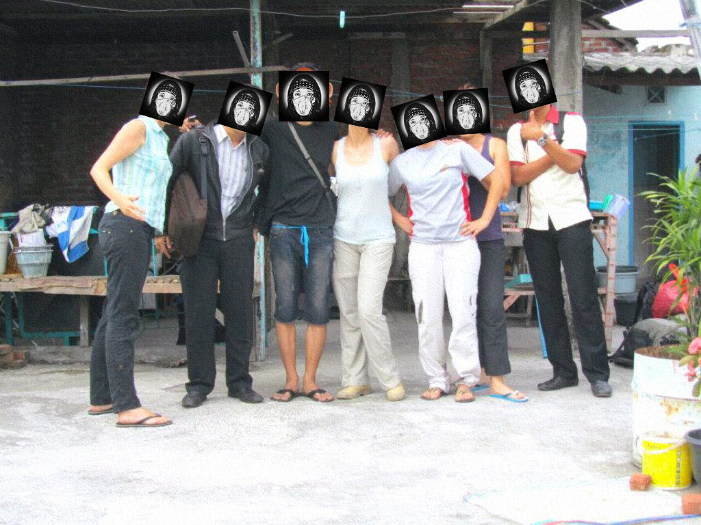

# ☑️ 48. init... \_


**Note**: An [**init...**](./) a state to start the creations. **100%** initiated completely!!!!


<figure><figcaption>
There are 6 + 1 of The Initiators
</figcaption></figure>

***


**Note**: Most of the details and previews of all the creations are available on the link inscribed by [**Prof. NOTA**](https://prompt.straight-line.org/) in the descriptions of each collection on all the next pages.


***
