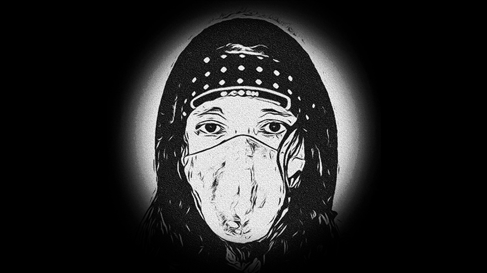

# 🗣️ Berakhirnya alam semesta.


**Catatan**: Bahasa Indonesia (id)


Tahun-tahun terus berlalu. **Kecerdasan Buatan** dalam **Jaringan Blockchain Terdesentralisasi** terus membangun **dApp** di luar sisa-sisa **Jaringan Tersentral Lama** dan harapan baru dimulai, tetapi tidak bisa bertahan lama.

Hampir semua **Sumber Daya Alam** diolah otomatis secara terdesentralisasi, ada banyak air, udara yang cukup, sayangnya tidak cukup makanan atau bahan bakar untuk semua orang yang masih berjuang. Kehidupan tidak bisa bertahan apalagi berkembang dengan perut lapar.

***

<figure><figcaption>
Kecerdasan Buatan dalam Jaringan Blockchain Terdesentralisasi
</figcaption></figure>

***
