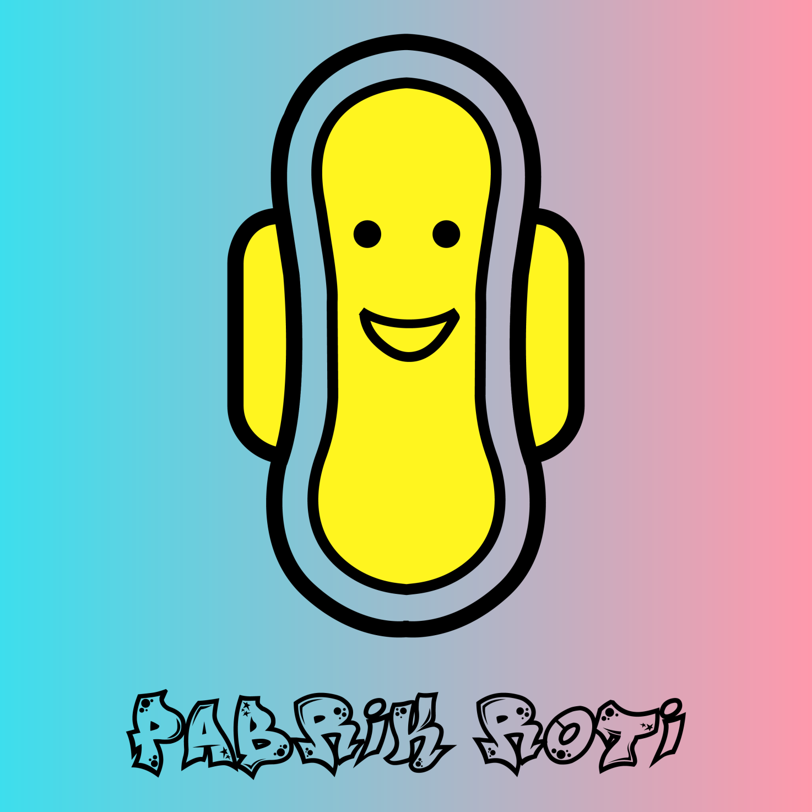
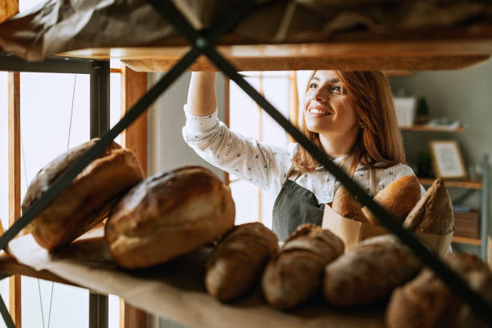
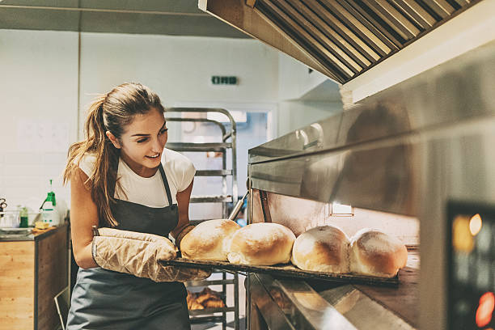

# 🍞 Breads Factory


**Note**: [**Breads Factory**](./) uses the username [**pabrikroti**](./)**.**




### Preface...

[**The Breads Factory**](./) is a factory that produces **Programmed Bread** with a **Framework** of **Playing**, **Learning**, and **Working,** or **PLW**.

In [**The Breads Factory**](./), many kinds of **Bread** were **Designed**, **Produced**, **Programmed**, also **Distributed**, or **DPPD,** so they can always be loved, wanted, existed, endured, or **High Availability** or **HA**, and have eternity, or **Decentralized** to meet the needs of everything until the end of the **Universe #3**.

***

<figure><figcaption><p>Logo of The Breads Factory</p></figcaption></figure>

***

```
Kondom Berduri! © Since 2021 by The Breads Factory
```



### About [**The Breads Factory**](./)

[**The Breads Factory**](./) is based on the intelligence of three individuals, **Human Intelligence v3.0**, or **HI v3.0**, who really want to bake a loaf of **Bread** in the **Framework PLW**. Because as someone who lives, or can do, think, and feel for a loaf of **Bread**, **Playing**, **Learning**, and **Working** are things that have the same priority and portion.

For a loaf of **Bread**, **Playing** can be fun, and enjoy the process, **Learning** can be smart or at least can improve one's abilities, then **Working** can be established and still earn to pay off all costs, bills, debts, and even treats.

For everyone who lives for a loaf of **Bread**, in [**The Breads Factory**](./) called [**Bakers**](./#bakers), the **Framework PLW** is more efficient, and the effect is so great that it can be used for subsequent loaves of **Bread**, regardless of the processing technique and whatever its shape or form.

Whether it's in the form of a mixture of coding, writing, pictures, illustrations, photography, animation, audio, music, video, film, or a combination of all those ingredients, **Ingredients Items,** or **I2**, from the idea to the concept as well as the process of **DPPD**, by [**The Breads Factory**](./) is ensured to be **Decentralized High Availability Programmed Bread** to meet the needs.

Because the **0101 Universe**, the **Digital World**, today is starting to become everything for everyone, over time, to meet the needs of everything, **Programmed Bread** has to penetrate not only off the network or **Offline** but also on the network or **Online**.

Starting from social media, streaming, marketplace, or becoming a **Non-Fungible Token**, or **NFT** on the blockchain network, up to licensing, and royalties also penetrate the network.

Everyone can't be sure what the needs of everything are, but the meeting between those who need and those who are needed, [**Bakers**](./#bakers) and [**Bakers**](./#bakers), the market, or its investors, **Programmed Bread** and the market, or its investors, or vice versa, can always occur when **Programmed Bread** with **High Availability** has **Decentralized**, just keep venturing to penetrate the network.

It is hoped that a goal will be achieved, that [**The Bread Factory**](./) becomes **Space-Time** for all [**Bakers**](./#bakers) with **Human Intelligence v3.0** who are free to use the **Framework PLW** to continue to shape and move in the **Universe #3** without fear of running out of supplies in the form of **Decentralized High Availability Programmed Bread**.

***

### [The Breads Factory](./) Crumbs

1. Material Selection\
   **The Cosmic Questions**
2. Material Weighing\
   **Infinite Expansion**
3. Mixing the Ingredients into the Dough\
   **The Big Rip**
4. Dough Molding\
   **The Big Crunch**
5. Examination of Mold Results\
   **The Event Horizon**
6. Baking into **Bread**\
   **The Singularity**
7. The Creation of **Bread**\
   **An Event Called The Big Bang**
8. **Bread** Storage And Cooling\
   **As Space-Time Expanded, The Universe Cooled, and Matter Formed**
9. **Bread** Distribution\
   **Space-Time Tells Matter How to Move, and Matter Tells Space-Time How To Curve**

***

### The Master Repository

> _This is not just a factory. This is a rehearsal of freedom—kneaded with code, fermented by its community, and baked through the heat of shared struggles._
>
> — **Prof. NOTA**
>
> — Source: [**pabrikroti-master**](https://github.com/myreceiptt/pabrikroti-master)

***

```
Kondom Berduri! © Since 2021 by The Breads Factory
```



### The [**Bakers**](./#bakers)

In the meantime, there are no [**Bakers**](./#bakers) at [**The Breads Factory**](./). Over time, it will always be updated since the [**Bakers**](./#bakers) in [**The Breads Factory**](./) can always come and go, even not at all.

***

### The [**Bakers**](./#bakers) Presence

<div><figure><figcaption><p>Sulis Elizabeth counts bread stock</p></figcaption></figure> <figure><figcaption><p>Nur Catherine &#x26; Stephanie Saroh selling bread</p></figcaption></figure></div>

<div><figure><figcaption><p>Lilik Caroline makes bread</p></figcaption></figure> <figure><figcaption><p>Tiffany Siti will make bread</p></figcaption></figure></div>

***

### Open Recruitment

If this is something you love, that you can do, and that you want to do in the hopes of not harming or hurting others, then [**The Breads Factory**](./) invites you to become one of the [**Bakers**](./#bakers), that is, someone who lives for a loaf of **Bread**.

Be a woman who is free to **Play**, **Learn**, and **Work** for a loaf of **Bread** at [**The Breads Factory**](./).

#### Please answer the following questions!

* Do you prefer **MONEY** or **SEX** in this life? Why? Explain it!

#### Please send the answers to the questions above!

You can send the answer via [**Prof. NOTA's Discord**](https://discord.gg/5KrsT6MbFm) anytime and anywhere using your Discord account. So please join [**Prof. NOTA's Discord**](https://discord.gg/5KrsT6MbFm).

#### There is no charge for this recruitment.

Beware of parties acting on behalf of [**The Breads Factory**](./), be it individuals, groups, organizations, or agencies. [**The Breads Factory**](./) never charges the [**Bakers**](./#bakers) candidate a penny. So, beware of scams!!!!

***

```
Kondom Berduri! © Since 2021 by The Breads Factory
```



### Questions and Answers

> **Q**: To be full, what do you eat?
>
> **A**: Eat some **Bread** to be full.

> **Q**: Why should [**The Breads Factory**](./)?
>
> **A1**: Since eating some **Bread** can make you full, there must be [**The Breads Factory**](./).
>
> **A2**: Aren't many still hungry?!?!

***

```
Kondom Berduri! © Since 2021 by The Breads Factory
```



***
