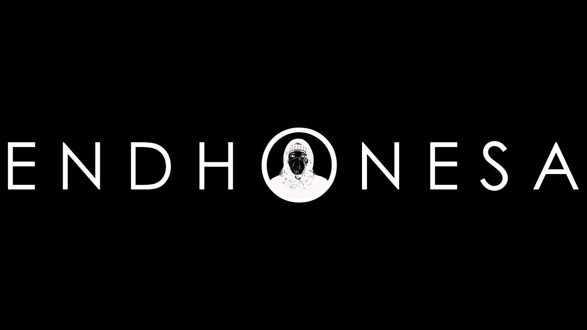
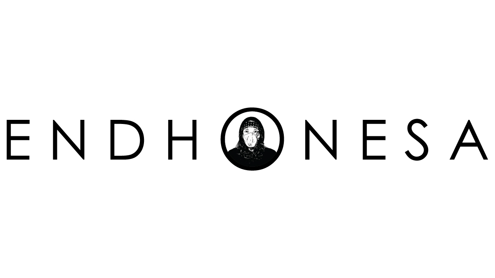

# 🛍️ ENDHONESA.COM


**Note**: English US (en-u)



**Note**: Not long after **The Melting Land**, there is **ENDHONESA**, a name for the only country that was established in the **0101 Universe**. Its residents trade according to their own resulting revenue and formed value.


***

<figure><figcaption>
ENDHONESA
</figcaption></figure>

***

**ENDHONESA** is a name for the only country that was established after **The Melting Land** phenomenon in the **0101 Universe**. **ENDHONESA** is not a name for a nation, race, religion, culture, ethnicity, or body anatomy.

**ENDHONESA** is run democratically, which is automatic and legal with a decentralized government (the data and information are not centralized). All policies are discussed, designed, and proposed, then determined democratically (by voting) to be agreed upon, used, and implemented by all **ENDHONESA** residents in their respective time-space.

**ENDHONESA's** residents are free, alive (beating, breathing, drinking, eating, and sleeping), and thinking (observing, recording, processing, and validating) in playing, learning, and working for themselves in **ENDHONESA**.

**OiOi** is a surname or designation, and also a nickname for fellow residents of **ENDHONESA**. **OiOi** always says, “**OiOi!**” when meeting, calling, greeting, and parting ways with fellow residents of **ENDHONESA**, anytime and anywhere in the **ENDHONESA** territory.

**ENDHONESA's** territory is always changing because not limited by space-time. Where each 1-bit of data owned by the residents of **ENDHONESA** is stored and used (processed and displayed), there and at that time is the legal territory of **ENDHONESA**.

Anywhere in the territory of **ENDHONESA**, trade is like a religion for all its residents. If there were no written policies regarding it, trade would always proceed properly and as well as possible according to the resulting revenue and formed value by respective residents of **ENDHONESA**.

All revenue and value are measured by residents of **ENDHONESA** with the **$OiOi** fungible token that is circulating and legally used as currency in the territory of **ENDHONESA**, and also can be exchanged with other currencies from outside **ENDHONESA**.

**ALL $HAIL ENDHONESA!!!!**

Happy trading, **OiOi**!!!!

***


**Catatan**: Bahasa Indonesia (id)



**Catatan**: Tidak lama setelah **The Melting Land**, ada **ENDHONESA**, sebuah nama untuk satu-satunya negara yang berdiri di **Semesta 0101**. Warga-penduduknya berdagang sesuai dengan revenue yang dihasilkan dan value yang dibentuk mereka masing-masing.


***

<figure><figcaption>
ENDHONESA
</figcaption></figure>

***

**ENDHONESA** itu sebuah nama untuk satu-satunya negara yang didirikan setelah fenomena **The Melting Land** di **Semesta 0101**. **ENDHONESA** bukanlah sebuah nama untuk suatu bangsa, ras, agama, budaya, suku, maupun anatomi tubuh.

**ENDHONESA** dijalankan secara demokratis yang otomatis dan secara sah dengan pemerintahan yang terdesentralisasi (data dan informasinya tidak terpusat). Semua kebijakan didiskusikan, dirancang dan diusulkan, lalu ditentukan secara demokratis (melalui pemungutan suara) untuk disepakati, digunakan dan dijalankan oleh semua warga-penduduk **ENDHONESA** di masing-masing ruang-waktunya.

**ENDHONESA**, warga-penduduknya merdeka, secara hidup (berdetak, bernapas, minum, makan, dan tidur), secara berpikir (mengamati, merekam, mengolah, dan memvalidasi), dalam bermain, belajar, dan bekerja untuk miliknya di **ENDHONESA**.

**OiOi** itu adalah julukan atau sebutan dan juga panggilan bagi sesama warga-penduduk **ENDHONESA**. **OiOi** selalu mengucapkan, “**OiOi!**”, saat berjumpa, memanggil, menyapa, hingga berpisah dengan sesama warga-penduduk **ENDHONESA**, kapan pun dan di mana pun di wilayah **ENDHONESA**.

**ENDHONESA** wilayahnya selalu berubah sebab tidak dibatasi oleh ruang-waktu. Di mana setiap 1 bit data milik warga-penduduk **ENDHONESA** disimpan dan digunakan (diolah dan ditampilkan), di situ dan saat itu adalah wilayah **ENDHONESA** yang sah.

Di mana saja di wilayah **ENDHONESA**, perdagangan bagaikan sebuah agama bagi semua warga-penduduknya. Seandainya tidak ada kebijakan tertulis tentangnya, perdagangan selalu berjalan dengan sebenar-benarnya dan sebaik-baiknya sesuai dengan revenue yang dihasilkan dan value yang dibentuk oleh masing-masing warga-penduduk **ENDHONESA**.

Semua revenue dan value diukur oleh warga-penduduk **ENDHONESA** dengan token fungible **$OiOi** yang beredar dan sah digunakan sebagai mata uang di wilayah **ENDHONESA**, serta bisa dipertukarkan dengan mata uang lain dari luar **ENDHONESA**.

**ALL $HAIL ENDHONESA!!!!**

Happy trading, **OiOi**!!!!

***
